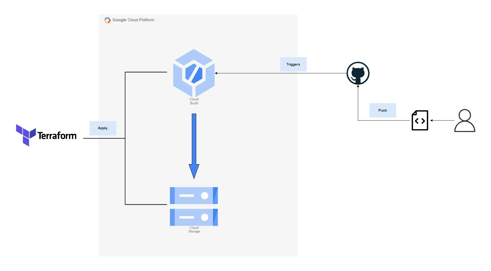

# GCP Final Project - ITI
## Use Case Description: 
### CloudBuild and DAGs Integration for Live Bucket in Analytics Field:

    In the analytics field, there is often a need to grant and revoke permissions to service accounts for accessing data 
    stored in a live bucket. 
    This process can be time-consuming and error-prone, especially when dealing with a large number of DAGs 
    (Directed Acyclic Graphs) that require access to the live bucket.

#### Here's a high-level overview of the use case:

    Set up CloudBuild: 
        Configure the CloudBuild service to monitor changes in the repository where the DAGs are stored.

    Trigger DAG Update: 
        Whenever a change is detected in the repository, CloudBuild triggers an automated workflow.

    Build: 
        The CloudBuild workflow fetches the updated DAGs from the repository and performs any necessary build steps.

    Access Permissions:
        CloudBuild uses appropriate service account credentials with predefined permissions to interact with the bucket.

    DAG Deployment: 
        Upon successful build and validation, CloudBuild deploys the updated DAGs to the live bucket.

## Demo Example:

## Contributors:
- [Ahmed Nabil Sharawy](https://www.linkedin.com/in/ahmed-nabil-sharawy-149880104/)
- [Adham Mohamed Gaber](https://www.linkedin.com/in/adhammgaber/)
- [Hager Essam AboShady](https://www.linkedin.com/in/hager-aboshady/)
- [Mohamed Elsherief](###)

## License
This project is licensed under the [MIT License](LICENSE).
